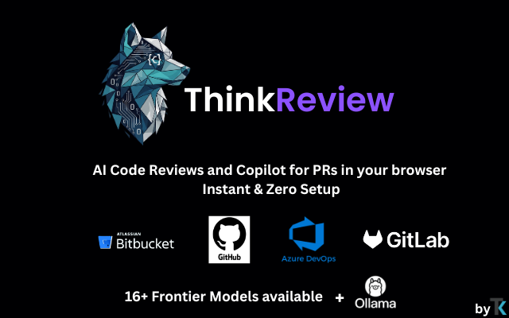
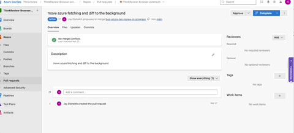
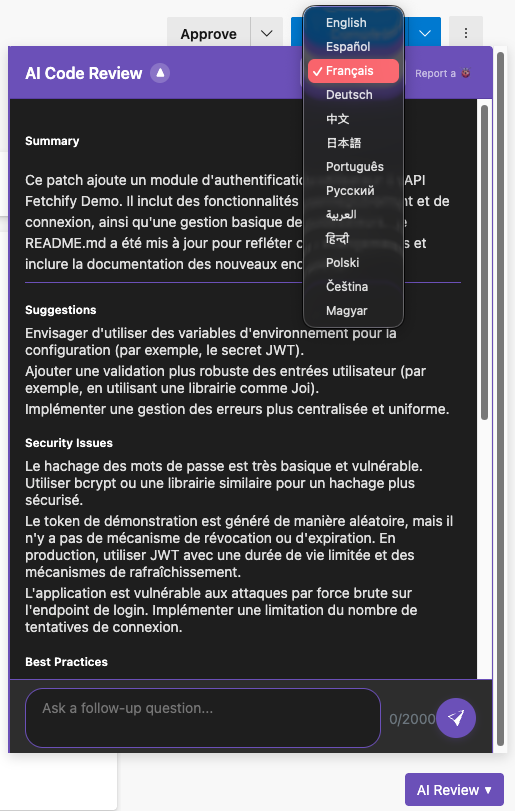
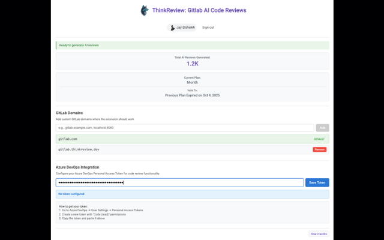

<div align="center">

# 🚀 ThinkReview

### AI Code Review for GitLab & Azure DevOps

[](https://chromewebstore.google.com/detail/thinkreview-ai-code-revie/bpgkhgbchmlmpjjpmlaiejhnnbkdjdjn)
[](https://thinkreview.dev/release-notes)
[](https://chromewebstore.google.com/detail/thinkreview-ai-code-revie/bpgkhgbchmlmpjjpmlaiejhnnbkdjdjn)
[](LICENSE)
[](OLLAMA_SETUP.md)

**AI-powered code reviews for merge requests and pull requests, directly in your browser.**

[🌐 Website](https://thinkreview.dev) • [📦 Install](https://chromewebstore.google.com/detail/thinkreview-ai-code-revie/bpgkhgbchmlmpjjpmlaiejhnnbkdjdjn) • [🖥️ Ollama Setup](OLLAMA_SETUP.md) • [📖 Docs](#documentation) • [💬 Contact](https://thinkreview.dev/contact)



</div>

---

## 🎉 Now Open Source!

ThinkReview is a **production-ready browser extension** that brings AI-powered code reviews to GitLab and Azure DevOps. After months of development, we're excited to open source the extension!

> ### 🆕 NEW: Local AI Support with Ollama!
> Run code reviews **100% privately** on your own hardware with Ollama.  
> No cloud, no API calls, complete control over your code.  
> **📖 [Quick Setup Guide →](OLLAMA_SETUP.md)** (30 seconds if model is downloaded)

### 🌟 Key Stats

- ⭐ **5.0/5** rating on Chrome Web Store
- 📦 Check [latest releases](https://thinkreview.dev/release-notes)
- 🏆 **Featured** by Chrome Web Store
- ✅ **Good Publisher Record** with no violations
- 📜 Follows **recommended practices** for Chrome extensions

---

## ✨ Features

### 🤖 AI-Powered Code Reviews

**Choose Your AI Provider:**

| Provider | Privacy | Cost | Speed | Setup |
|----------|---------|------|-------|-------|
| **☁️ Cloud AI (Advanced Models)** | Google Cloud | Free tier | ⚡ Very Fast | None - works instantly |
| **🖥️ Local Ollama** 🆕 | 🔒 100% Local | Completely Free | Hardware dependent | [30 sec setup](OLLAMA_SETUP.md) (if model downloaded) |

**Features:**
- **Instant Analysis**: Get AI-driven insights on code changes
- **Security Detection**: Automatically identify potential vulnerabilities
- **Code Quality**: Receive suggestions for improvements
- **Smart Summaries**: Quickly understand complex changes
- **Quality Metrics**: Code quality scores and metrics
- **Suggested Questions**: Context-aware follow-up questions

<div align="center">
  
  <p><em>AI-powered code review in action</em></p>
</div>

### 💬 AI Copilot
- **Chat with PRs**: Ask questions about your pull requests
- **Suggested Questions**: Get smart, context-aware queries
- **Deep Dive**: Explore code changes interactively

### 🔧 Platform Support
- ✅ **GitLab** (gitlab.com, GitLab Enterprise, Self-Hosted)
- ✅ **Azure DevOps** (dev.azure.com, custom domains)
- ✅ Works with **any GitLab instance** on custom domains

<div align="center">
  
  <p><em>Seamless Azure DevOps integration</em></p>
</div>

### 🚀 Quick Start
- **Cloud AI**: Zero setup - works instantly after install
- **Local AI**: [Quick Ollama setup](OLLAMA_SETUP.md) (30 seconds if model is downloaded) for private reviews
- **No API Keys**: Works out of the box (cloud) or fully local (Ollama)
- **Automatic Detection**: Recognizes MR/PR pages instantly
- **Seamless Integration**: Doesn't disrupt your workflow

### 🌍 Multilingual Support
- **Reviews in Your Language**: Get code reviews in 20+ languages
- **Automatic Language Detection**: Adapts to your preferences

<div align="center">
  
  <p><em>Code reviews in your preferred language</em></p>
</div>

### ⚙️ Flexible Configuration
- **Custom Domains**: Works with self-hosted GitLab instances
- **Azure DevOps PAT**: Configure personal access tokens for private repos
- **Team Settings**: Customize for your organization's needs

<div align="center">
  
  <p><em>Configure custom domains and Azure DevOps tokens</em></p>
</div>

### 🔐 Privacy & Security
- 🔒 **Secure Authentication**: Google OAuth
- 🔐 **HTTPS**: All requests encrypted
- 🛡️ **No Stored Keys**: No API keys in extension code
- 📊 **Minimal Permissions**: Only activates on MR/PR pages
- 🖥️ **🆕 100% Local Option**: Use Ollama for completely private reviews - [Setup Guide](OLLAMA_SETUP.md)

---

## 📦 Installation

### From Chrome Web Store (Recommended)

[](https://chromewebstore.google.com/detail/thinkreview-ai-code-revie/bpgkhgbchmlmpjjpmlaiejhnnbkdjdjn)

1. Visit the [Chrome Web Store listing](https://chromewebstore.google.com/detail/thinkreview-ai-code-revie/bpgkhgbchmlmpjjpmlaiejhnnbkdjdjn)
2. Click "Add to Chrome"
3. That's it! Navigate to any GitLab MR or Azure DevOps PR to start

### For Developers (Load Unpacked)

```bash
# Clone the repository
git clone https://github.com/Thinkode/thinkreview-browser-extension.git
cd thinkreview-browser-extension

# Load in Chrome
# 1. Open Chrome and navigate to chrome://extensions/
# 2. Enable "Developer mode" (toggle in top right)
# 3. Click "Load unpacked"
# 4. Select the cloned directory
```

### Choose Your AI Provider (Optional)

**Cloud AI (Default)** - Works immediately, no setup required  
**Local AI with Ollama** - For 100% private reviews:
1. Follow the [Ollama Setup Guide](OLLAMA_SETUP.md) (30 seconds if model is downloaded)
2. Open extension popup → Settings → Select "Local Ollama"
3. That's it! Your reviews now run locally

---

## 🎯 Usage

1. **Navigate** to any GitLab merge request or Azure DevOps pull request
2. **Wait** for automatic detection (usually instant)
3. **View** AI-powered code review in integrated panel
4. **Chat** with your PR using the AI copilot feature
5. **Review** suggestions and security findings

### Supported URLs
- `https://gitlab.com/*/merge_requests/*`
- `https://your-gitlab-instance.com/*/merge_requests/*`
- `https://dev.azure.com/*/*/_git/*/pullrequest/*`
- `https://*.visualstudio.com/*/*/_git/*/pullrequest/*`

---

## 🏗️ Architecture

ThinkReview consists of two main components:

### 1. **Browser Extension** (This Repository)
- Manifest V3 Chrome extension
- Content scripts for GitLab & Azure DevOps
- UI components and integration
- OAuth authentication flow

### 2. **Backend Services** (Proprietary)
- AI model integration (Advanced AI models)
- Code review processing
- User management and subscriptions
- Hosted at `us-central1-thinkgpt.cloudfunctions.net`

**Note**: The extension requires connection to ThinkReview backend services. For commercial deployments with your own backend, [contact us](mailto:support@thinkode.co.uk) for licensing options.

---

## 📚 Documentation

### Project Structure

```
thinkreview-browser-extension/
├── manifest.json           # Extension configuration
├── background.js           # Service worker
├── content.js             # Main content script
├── popup.html/js/css      # Extension popup
├── components/            # UI components
│   ├── integrated-review.js
│   ├── google-signin/
│   ├── review-prompt/
│   └── subscription.js
├── services/              # Backend integration
│   ├── cloud-service.js
│   ├── ollama-service.js  # 🆕 Local AI integration
│   ├── azure-devops-api.js
│   └── platform-detector.js
├── utils/                 # Helper utilities
├── images/               # Icons and assets
└── release-notes/        # Version history
```

### Key Guides

- **[Release Notes](release%20notes/)** - Detailed version history
- **🆕 [OLLAMA_SETUP.md](OLLAMA_SETUP.md)** - Run AI reviews locally with Ollama

---

## 📈 Version History

ThinkReview has been in active development with regular releases. Check [latest releases](https://thinkreview.dev/release-notes) for the complete version history.

📁 **Full changelog**: See [`release-notes/`](release%20notes/) directory or visit [thinkreview.dev/release-notes](https://thinkreview.dev/release-notes)

---

## 🤝 Contributing

We welcome contributions! ThinkReview is now open source and we'd love your help.

### How to Contribute

1. **Fork** the repository
2. **Create** a feature branch (`git checkout -b feature/amazing-feature`)
3. **Commit** your changes (`git commit -m 'Add amazing feature'`)
4. **Push** to the branch (`git push origin feature/amazing-feature`)
5. **Open** a Pull Request

### Development Setup

```bash
# Clone your fork
git clone https://github.com/your-username/thinkreview-browser-extension.git
cd thinkreview-browser-extension

# Install dependencies (if any)
npm install

# Load extension in Chrome (see Installation section above)
```

### Guidelines

- Follow existing code style
- Add tests for new features
- Update documentation
- Keep commits atomic and well-described

See [CONTRIBUTING.md](CONTRIBUTING.md) for detailed guidelines.

---

## 🐛 Issues & Support

### Found a Bug?
[Open an issue](https://github.com/Thinkode/thinkreview-browser-extension/issues/new) with:
- Description of the bug
- Steps to reproduce
- Expected vs actual behavior
- Screenshots (if applicable)
- Browser version and OS

### Need Help?
- 📧 Contact Form: [thinkreview.dev/contact](https://thinkreview.dev/contact)
- 💬 Email: [support@thinkreview.dev](mailto:support@thinkreview.dev)
- 🌐 Website: [thinkreview.dev](https://thinkreview.dev)
- 💬 GitHub Discussions: [Ask questions](https://github.com/Thinkode/thinkreview-browser-extension/discussions)

---

## 📜 License

This project is licensed under the **GNU Affero General Public License v3.0 (AGPL-3.0)**.

### What This Means

✅ **You can:**
- Use the extension freely
- Study and modify the code
- Distribute your modifications
- Use it commercially

⚠️ **You must:**
- Share your modifications under AGPL-3.0
- Disclose source code when distributing
- Include license and copyright notice
- State significant changes made

### Commercial Licensing

For commercial deployments with your own backend or proprietary modifications:
- 📧 Contact: [thinkreview.dev/contact](https://thinkreview.dev/contact)
- 🌐 Learn more: [thinkreview.dev](https://thinkreview.dev)

See [LICENSE](LICENSE) for full details.

---

## 🔗 Links

- 🏪 **Chrome Web Store**: [Install ThinkReview](https://chromewebstore.google.com/detail/thinkreview-ai-code-revie/bpgkhgbchmlmpjjpmlaiejhnnbkdjdjn)
- 🌐 **Official Website**: [thinkreview.dev](https://thinkreview.dev)
- 📧 **Contact & Support**: [thinkreview.dev/contact](https://thinkreview.dev/contact)
- 🐛 **Report Issues**: [GitHub Issues](https://github.com/Thinkode/thinkreview-browser-extension/issues)
- 💬 **Discussions**: [GitHub Discussions](https://github.com/Thinkode/thinkreview-browser-extension/discussions)

---

## 🌟 Why Open Source?

After successfully launching on the Chrome Web Store and serving 128+ users, we decided to open source ThinkReview because:

✅ **Transparency** - Let the community see and verify how it works  
✅ **Trust** - Open code builds confidence in security and privacy  
✅ **Collaboration** - Accelerate development with community contributions  
✅ **Innovation** - Enable developers to extend and customize  
✅ **Education** - Help others learn from production-grade code

---

## 💼 About

ThinkReview is developed and maintained by the Thinkode team. The extension is production-ready and actively used by developers worldwide for improving code quality and accelerating code reviews.

**Built with:**
- Manifest V3
- Advanced AI Models
- Vanilla JavaScript
- Chrome Extensions API

---

## ⭐ Show Your Support

If ThinkReview helps you with code reviews, please:
- ⭐ Star this repository
- 🔄 Share with your team
- ✍️ Leave a review on [Chrome Web Store](https://chromewebstore.google.com/detail/thinkreview-ai-code-revie/bpgkhgbchmlmpjjpmlaiejhnnbkdjdjn)
- 🐛 Report bugs and suggest features

---

<div align="center">

**Made with ❤️ by the Thinkode Team**

[Website](https://thinkreview.dev) • [Chrome Store](https://chromewebstore.google.com/detail/thinkreview-ai-code-revie/bpgkhgbchmlmpjjpmlaiejhnnbkdjdjn) • [Support](mailto:support@thinkode.co.uk)

</div>
